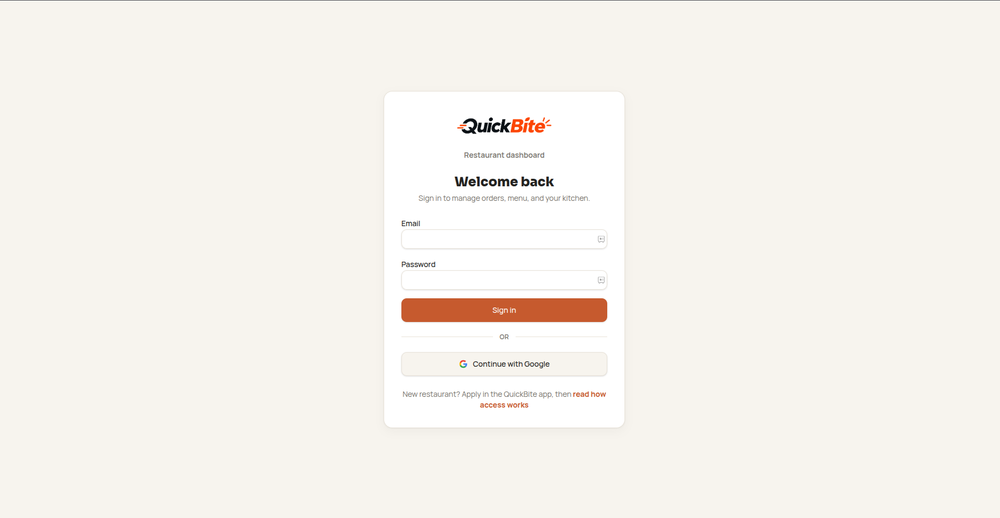
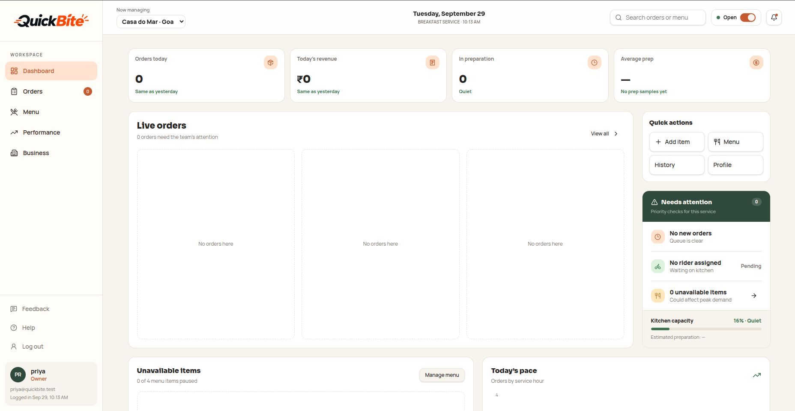
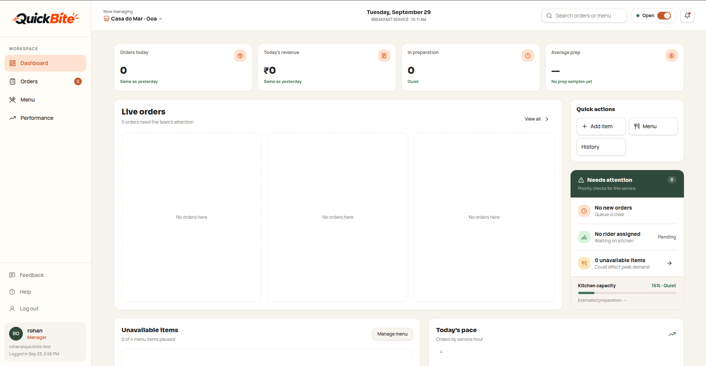

# QuickBite

Food ordering & delivery for customers, riders, and restaurants — a Swiggy/Zomato-style monorepo with one mobile app, one role-based web dashboard, and a shared Supabase backend.

**Live**

| Surface | Link |
|---------|------|
| Restaurant dashboard | [quickbite-nine-phi.vercel.app](https://quickbite-nine-phi.vercel.app/) |
| Marketing landing | `apps/landing` (deploy separately; see below) |
| GitHub | [sanketrotangar-sji/quickbite-food-delivery-app](https://github.com/sanketrotangar-sji/quickbite-food-delivery-app) |
| Lovable preview | [lovable.dev/preview/…](https://lovable.dev/preview/6ARtcZ0ZZ4pp7dyqkNsE5hYC1hWWdWBv) |

**Docs:** [Architecture](./docs/architecture.md) · [Setup & run](./docs/setup.md) · [System flow](./docs/system-flow.md) · [Requirements](./docs/requirements.md) · [ML classifier](./docs/ml/README.md)

---

## Screenshots

<p align="center">
  
  <br />
  <em>Shared web login — admins, owners, and managers land on role-specific screens</em>
</p>

<p align="center">
  
  <br />
  <em>Owner dashboard — restaurants, branches, and operations overview</em>
</p>

<p align="center">
  
  <br />
  <em>Manager kitchen — live orders, menu, and branch controls</em>
</p>

---

## Features

- **Customer app** — browse restaurants, cart, checkout, order tracking
- **Marketing landing** — public front door (`apps/landing`) with app download + dashboard login CTAs
- **Rider app** — duty toggle, accept deliveries, navigation handoff (same Expo client)
- **Restaurant dashboard** — owners and managers share one Vite app; screens differ by role
- **Admin** — platform oversight from `/admin` (seeded role)
- **Auth** — email/password and Google via Supabase Auth
- **Security** — Postgres RLS + RPCs so each role only sees its own data
- **Realtime** — order status and kitchen updates over Supabase Realtime
- **Edge functions** — order notifications, directions, push token registration, RIO assistant
- **Intelligence** — RAG-grounded RIO, support tickets, auto rider assign on `ready`, kitchen-load ETA alerts

---

## Tech stack

| Layer | Technology |
|-------|------------|
| Mobile | Expo Router (React Native) — `apps/client` |
| Marketing site | Vite + React — `apps/landing` |
| Web dashboard | Vite + React — `apps/manager` |
| Backend | Supabase (Auth, Postgres, RLS, Realtime, Edge Functions) |
| AI / RAG | Groq or Ollama chat (`llm_config`) · Ollama `nomic-embed-text` · pgvector |
| Deploy | Vercel (landing + dashboard) · Expo Go / EAS (mobile) · Supabase (API & DB) |

---

## Architecture

```text
┌─────────────────┐
│  apps/landing   │  public marketing entry
│  Get App · Login│
└────────┬────────┘
         │ Dashboard Login → /login
         ▼
┌──────────────────────────────┐  ┌─────────────────────┐
│  apps/manager                │  │  apps/client        │
│  admin · owner · manager     │  │  customer · rider   │
└──────────────┬───────────────┘  └──────────┬──────────┘
               │                             │
               └──────────────┬──────────────┘
                              ▼
                   Supabase Auth · Postgres · RLS
```

| Role | App | How they get it |
|------|-----|-----------------|
| Customer | `apps/client` | Default on signup |
| Rider | `apps/client` | Apply in Settings → admin approves |
| Restaurant owner | `apps/manager` | Apply in Settings → admin approves |
| Restaurant manager | `apps/manager` | Owner email invite |
| Admin | `apps/manager` `/admin` | SQL seed only |

Full detail: [`docs/architecture.md`](./docs/architecture.md) · order handoffs: [`docs/system-flow.md`](./docs/system-flow.md)

---

## Repository structure

```text
QuickBite/
├── apps/
│   ├── landing/          # Public marketing site (ecosystem front door)
│   ├── manager/          # Web dashboard (admin + restaurant, by role)
│   └── client/           # Customer + rider Expo app
├── supabase/
│   ├── migrations/       # Schema, RLS, RPCs, grants
│   ├── functions/        # Edge Functions (notify-new-order, directions, …)
│   └── config.toml
├── packages/
│   └── shared/           # Shared types / constants
├── assets/               # README screenshots
├── docs/
│   └── ml/               # Offline category classifier metrics
├── scripts/              # Seed, embeddings backfill, intelligence verify, ML
├── .env.example
└── README.md
```

---

## Prerequisites

- **Node.js** ≥ 20
- **Docker** (for local Supabase)
- **Supabase CLI**
- Expo Go or an emulator (mobile)

---

## Quick start

### 1. Backend

```bash
supabase start          # needs Docker
supabase status         # copy API URL + anon key
```

Or use the linked cloud project:

```bash
supabase link --project-ref <YOUR_PROJECT_REF>
supabase db push
```

### 2. Environment

```bash
cp .env.example apps/manager/.env
cp apps/client/.env.example apps/client/.env
```

| App | Variables |
|-----|-----------|
| Manager | `VITE_SUPABASE_URL`, `VITE_SUPABASE_ANON_KEY` |
| Client | `EXPO_PUBLIC_SUPABASE_URL`, `EXPO_PUBLIC_SUPABASE_ANON_KEY` |

Server-only secrets (`SUPABASE_SERVICE_ROLE_KEY`, `WEBHOOK_SECRET`, …) belong in Supabase Edge Function secrets — never in client env. See [`.env.example`](./.env.example).

### 3. Frontends

From the repo root (npm workspaces):

```bash
npm install
npm run landing            # marketing site → http://localhost:5174
npm run dashboard          # web dashboard → http://localhost:5173
npm run client             # Expo → scan QR / press `a` or `i`
```

**Landing CTAs**

| Button | Destination |
|--------|-------------|
| Get the App / Download / store badges | `#download` — App Store / Play badges show **Coming soon** until `VITE_APP_STORE_URL` / `VITE_PLAY_STORE_URL` are set |
| Dashboard Login / Go to Dashboard | Production `https://quickbite-nine-phi.vercel.app/login` (override with `VITE_DASHBOARD_URL`) — after login, AuthGate routes each role to its dashboard |

Deploy `apps/landing` as its own Vercel project (root directory `apps/landing`, static Vite output). See [`apps/landing/.env.example`](./apps/landing/.env.example).

Or per app:

```bash
cd apps/landing && npm run dev
cd apps/manager && npm run dev
cd apps/client  && npx expo start
```

Full GitHub / Lovable / Expo / Vercel wiring: **[docs/setup.md](./docs/setup.md)**.

### Grader walkthrough (tests + RAG)

```bash
npm install
cp .env.example .env                    # add SUPABASE_SERVICE_ROLE_KEY for integration
cp .env.example apps/manager/.env       # VITE_SUPABASE_* from dashboard
cp apps/client/.env.example apps/client/.env

npm test                                # offline unit + edge; integration if .env set; Playwright skips without browsers
npm run embeddings:backfill -- --source all   # menu + ratings + order history → ≥5k vectors on seed
npm run rag:eval                        # needs Ollama + embeddings — see docs/rag/README.md
npm run dct:artifacts                   # refresh docs/dct/ test-run + checklist pointers
```

**Assessment 2 RAG story:** domain seed is ≥5,000 rows; the vector index covers menu items, reviews, **and order history** (`orders`, `order_items`, `order_status_history`). Metrics live in [`docs/rag/evaluation-report.md`](./docs/rag/evaluation-report.md) and classifier evidence in [`docs/ml/`](./docs/ml/). Submission packet: [`docs/dct/SUBMISSION.md`](./docs/dct/SUBMISSION.md).

RAG numbers live only in the generated report (do not copy stale metrics into this file).

---

## Scripts (root)

| Script | Purpose |
|--------|---------|
| `npm run supabase:start` | Local Supabase stack |
| `npm run supabase:stop` | Stop local stack |
| `npm run db:push` | Push migrations to linked cloud DB |
| `npm run functions:serve` | Serve edge functions locally |
| `npm run functions:deploy` | Deploy notify-new-order, directions, rio |
| `npm run embeddings:backfill` | Embed menu/ratings/**order history** into `embeddings` (`--source all` for ≥5k on seed; needs Ollama) |
| `npm run intelligence:verify` | Smoke-test RAG, tickets, auto-assign, kitchen-load |
| `npm run ml:classify-menu` | Offline sklearn category classifier → `docs/ml/` |
| `npm run test` | Unit (Vitest) + edge (Deno) + integration + Playwright (login + kitchen happy-path when `PLAYWRIGHT=1`) |
| `npm run dct:artifacts` | Capture test logs + evidence index → `docs/dct/` |
| `npm run rag:eval` | RAG retrieval report → [`docs/rag/evaluation-report.md`](./docs/rag/evaluation-report.md) |
| `npm run dct:artifacts` | Capture unit/edge/integration logs → [`docs/dct/`](./docs/dct/) for DCT submit |
| `npm run types:client` | Regenerate Expo `database.ts` from cloud schema |
| `npm run landing` | Start marketing site (`apps/landing`) |
| `npm run dashboard` | Start web dashboard (`apps/manager`) |
| `npm run client` | Start Expo client (`apps/client`) |

---

## Environment & secrets

| Kind | Where |
|------|--------|
| Public anon URL / key | App `.env` files (safe in client) |
| Service role, webhook, maps, Expo push tokens | Supabase secrets / server only |
| Never commit | `.env` (only `.env.example`) |

---

## Project status

Intern assignment — **SJ Innovation**. Built with Lovable + Supabase + Expo + Vercel.

See [`docs/requirements.md`](./docs/requirements.md) for the original brief.
