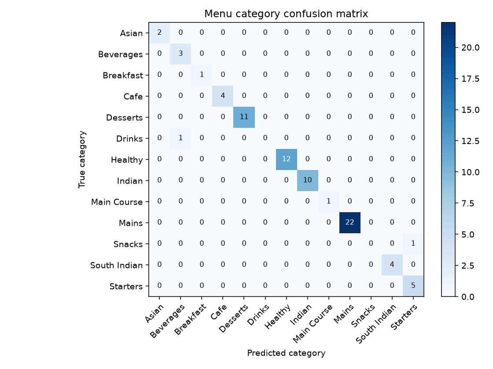

# QuickBite — Assessment 2 Report

**Intern:** Sanket Rotangar (Goa)  
**Mentor:** Amol — Tech Manager  
**Assessment:** SJ Innovation Assessment 2 (continuation of Assessment 1)  
**Generated:** 1 October 2026  

| Link | URL |
|------|-----|
| Live dashboard | https://quickbite-nine-phi.vercel.app/ |
| GitHub | https://github.com/sanketrotangar-sji/quickbite-food-delivery-app |
| Supabase project | `motqehtswgjbbvoazarh` |

---

## Assessment brief (one line)

Same QuickBite app, plus an AI agent, two automations, RAG on ≥5,000 records, LLM integration with ≥70% accuracy evidence, automated tests, polished UI, and documentation.

---

## Track 1 — AI agent (Option B: multi-step tools)

**Status: complete**

RIO is a tool-calling edge agent (`supabase/functions/rio/`), not freeform chat only. The model must call app RPCs/tools before answering.

| Tool | Purpose |
|------|---------|
| `retrieve_context` | RAG over pgvector embeddings (menu, ratings, order history) |
| `search_restaurants` / `get_menu` | Discovery |
| `view_cart` / `add_to_cart` / `update_cart_quantity` | Cart |
| `request_checkout` | Checkout handoff |
| `track_order` / `check_delivery_status` | Support / status |
| `escalate_complaint` | Creates a support ticket |

Client UI: `apps/client` RIO chat + action cards (`confirm_order` / `replace_cart` place via `place_order`).

**LLM:** Groq or Ollama via `llm_config` (`supabase/functions/_shared/llm.ts`). Admin can switch providers. Embeddings always use Ollama `nomic-embed-text` (768-d).

---

## Track 2 — Two workflows / automations

**Status: complete**

Both run without a user clicking through every step.

### 1. Smart rider assignment

- When an order becomes `ready`, trigger `orders_auto_assign_rider` calls `private.auto_assign_rider()`.
- Picks an available, least-busy / nearest rider and writes an `automation_events` audit row.
- Migration: `supabase/migrations/20260929160000_intelligence_layer.sql`.

### 2. Kitchen-load & delay alerts

- `public.run_kitchen_load_alerts()` detects overloaded branches and bumps ETA / notifies affected customers.
- Intended on a schedule via `pg_cron`; cooldown in `automation_config`.
- Customer tracking UI shows automation feedback when an ETA bump fires.

Verify: `npm run intelligence:verify`.

---

## Track 3 — RAG on ≥5,000 records

**Status: complete (corpus); eval reported honestly**

### Design

```text
chunk (row text) → Ollama nomic-embed-text → public.embeddings (pgvector)
                 → match_embeddings (cosine) → RIO retrieve_context
```

Sources: `menu_items`, `ratings`, `orders`, `order_items`, `order_status_history`.  
`source_id` is `text` so bigint status-history ids work (`20261001120000_match_embeddings_order_history.sql`).  
Backfill paginates past PostgREST’s 1000-row default (`scripts/backfill-embeddings.mjs`).

### Live corpus (stopped once ≥5k)

| Source | Vectors |
|--------|--------:|
| menu_items | 388 |
| ratings | 455 |
| orders | 758 |
| order_items | 1,916 |
| order_status_history | ~2,200+ |
| **Total** | **≈5,700+** |

(Domain seed itself is also ≥5k rows across profiles, menu, orders, history, etc.)

### Evaluation (three query sets)

Queries: `docs/rag/eval-queries.json` (refreshed from live `menu_items`).  
Report: `docs/rag/evaluation-report.md` · model `nomic-embed-text` · **k=5**.

| Set | Avg hit-rate@k | Avg precision@k |
|-----|---------------:|----------------:|
| matching | 37.5% | 10.0% |
| extreme | 0.0% | 0.0% |
| noisy | 20.0% | 5.0% |

**Clean vs noisy:** matching hit-rate **37.5% → 20.0%** under typos/junk (precision **10.0% → 5.0%**). Noise hurts retrieval as expected.

**Notes:** Matching queries use dish names against name+category+description embeddings; short queries often rank related-but-wrong dishes higher in this space. Extreme queries with empty expected IDs score 0 by the harness (retrieval still returns neighbors). Full re-embed with task prefixes was intentionally skipped after the ≥5k corpus bar was met.

---

## Track 4 — LLM integration + ≥70% accuracy

**Status: complete (97.4%)**

| Item | Value |
|------|--------|
| Task | Predict `menu_items.category` from embedding |
| Features | 768-d `nomic-embed-text` vectors |
| Model | Logistic regression (sklearn) |
| Split | 80/20 stratified (308 train / 77 test) |
| **Held-out accuracy** | **0.974 (97.4%)** |
| Meets ≥70% | **Yes** |

Evidence:

- `docs/ml/classification-metrics.json`
- `docs/ml/confusion_matrix.png`
- Script: `scripts/classify_menu_category.py` · `npm run ml:classify-menu`

Chat LLM (RIO) is separate: Groq/Ollama. Classifier is offline evidence for the train/test requirement (not wired into product UI).



---

## Track 5 — Test automation

**Status: complete — single-command suite + kitchen UI happy-path**

```bash
npm test
# = test:unit + test:edge + test:integration + test:e2e
```

| Layer | What | Command |
|-------|------|---------|
| Unit | Shared rules, auth form, order status, kitchen/rider helpers, client helpers | `npm run test:unit` |
| Edge | Deno `_shared` (embeddings/LLM helpers) | `npm run test:edge` |
| Integration | Order happy-path (service role) | `npm run test:integration` |
| E2E | Playwright: login smoke + **kitchen happy-path** (Accept → Mark ready) | `PLAYWRIGHT=1 npm run test:e2e` |

Last captured exits (`docs/dct/evidence-index.json`): unit **0**, edge **0**, integration **0**.

Kitchen E2E: manager signs in, advances a seeded `placed` order to `ready` on `/orders` (`apps/manager/e2e/kitchen-order-happy-path.spec.ts`). Needs `SUPABASE_SERVICE_ROLE_KEY` for the order fixture. Unit tests cover domain rules; integration covers API order→delivered.

---

## Track 6 — UI/UX

**Status: acceptable for scoring**

- Shared cream + brand card auth on client and manager (logo, Welcome back, Google outline).
- RIO chat with structured cards for restaurants/dishes/cart confirm.
- Loading / empty / error patterns on main flows; automation banner on order tracking.
- Known polish gaps (not blocking Assessment 2 AI tracks): customer rating submit UI, menu Edit stub, rider profile stubs.

---

## Track 7 — Docs (DCT upload deferred)

README, architecture, RAG (`docs/rag/`), ML (`docs/ml/`), and this report cover agent, automations, RAG design, metrics, and how to run tests.  
**Dev Control Tower upload is out of scope for this deliverable** (per operator request).

---

## Scoring parameters checklist

| Parameter | Max | How we meet it |
|-----------|----:|----------------|
| AI agent (tool-calling / multi-step) | 20 | RIO Option B tools + place/track/escalate |
| Two automations E2E | 15 | Auto-assign on ready + kitchen ETA alerts |
| RAG ≥5k + matching/extreme/noise report | 20 | ≈5.7k vectors + eval table above |
| LLM + ≥70% accuracy evidence | 15 | Groq/Ollama + **97.4%** classifier |
| Test automation | 15 | `npm test` + captured exits |
| Best-possible UI/UX | 10 | Auth, RIO, tracking feedback |
| Docs & DCT submission | 5 | Docs/metrics here; DCT upload later |
| **Total** | **100** | |
| Bonus (Ollama + real agent order) | +10 | Ollama path exists; full agent order demo optional |

---

## How to reproduce key evidence

```bash
npm run embeddings:backfill -- --source all   # paginated; stop once ≥5k if desired
npm run rag:eval                              # writes docs/rag/evaluation-report.md
npm run ml:classify-menu                      # ≥70% accuracy artifacts
npm test                                      # full automated suite
PLAYWRIGHT=1 npm run test:e2e                 # login + kitchen Accept→Ready (needs service role)
npm run intelligence:verify                   # automations smoke
```

---

## Known gaps (honest)

1. RAG matching hit-rate is moderate (37.5%); no full corpus re-embed with nomic task prefixes.

---

*SJ Innovation — Internal. Assessment 2 report for QuickBite. Prepared for mentor review.*
