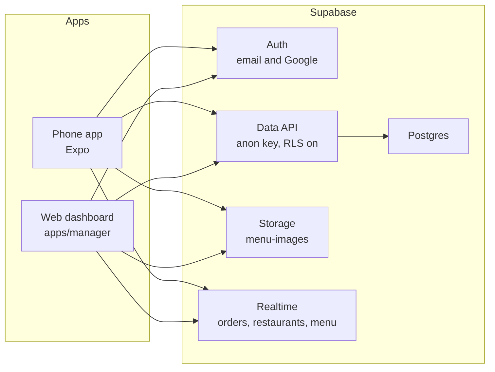
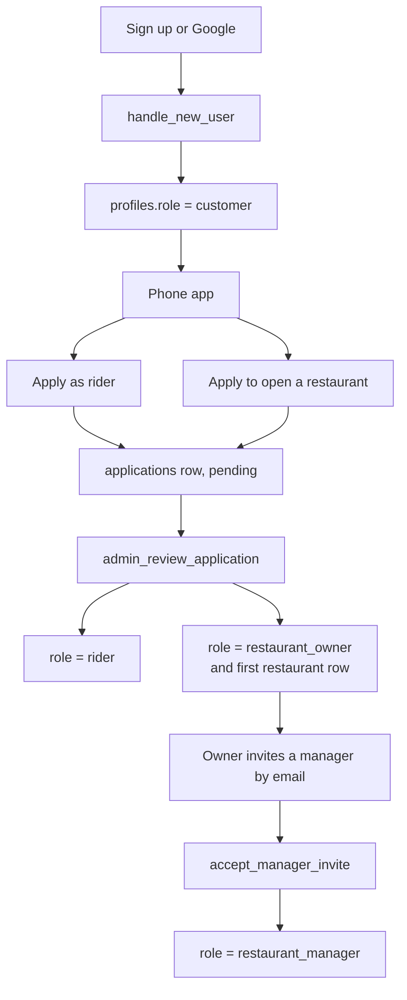
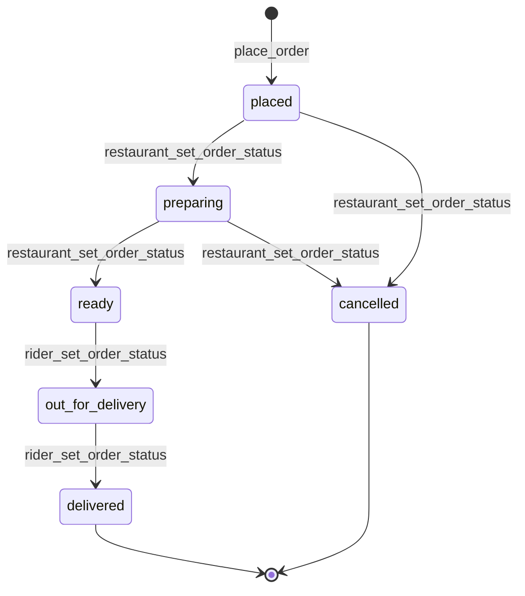
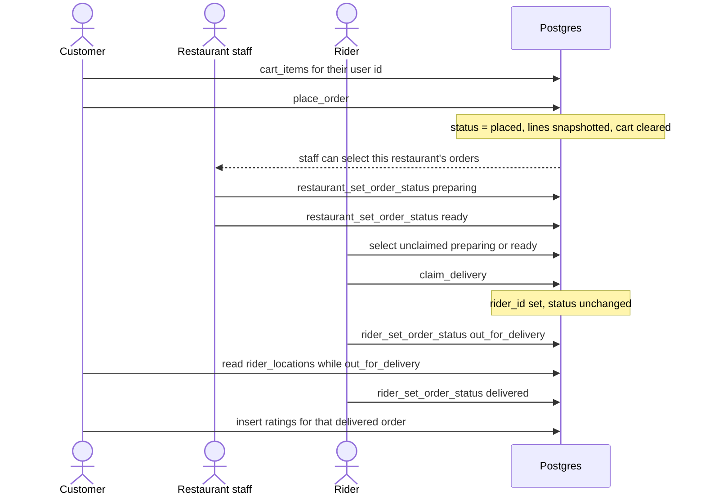
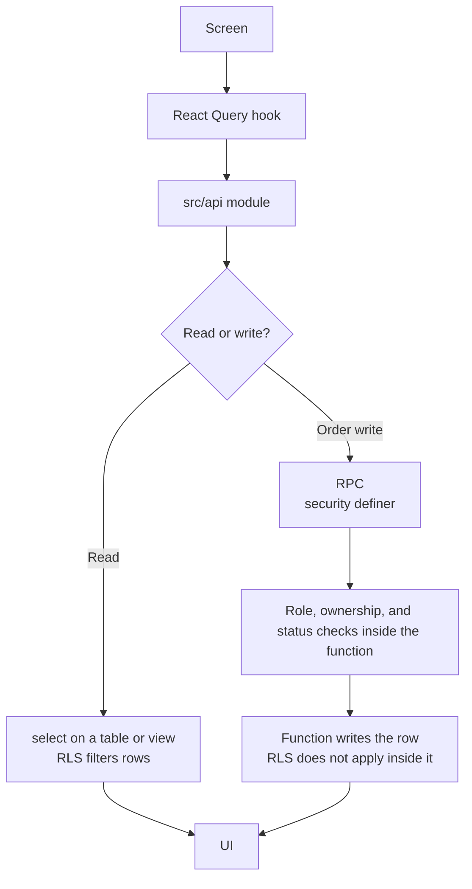

# QuickBite — system flow

How the product is put together, how one order moves between people, and which database rule lets each person see a row. This is the picture to walk in a project meeting. It describes the code and migrations in this repo, not a separate design that has not been built.

## 1. The system in one picture

Two apps share one Supabase project. The phone app serves customers and riders. The web dashboard at `apps/manager` serves restaurant owners, hired managers, and admins from one login. Admins land on `/admin`. Owners and managers land on the kitchen. None of the apps talk to each other directly. They all talk to Postgres through the Supabase API, and Postgres decides what each login may read or write.

The anon key is public. It does not mean the database is public. Every table below has row level security on. A query returns only the rows a policy allows for `auth.uid()`.

## 2. Who uses which app

| Person | `profiles.role` | Where they work | What they can do |
| --- | --- | --- | --- |
| Customer | `customer` | Phone, customer tabs | Browse, cart, place an order, track and rate their own orders |
| Rider | `rider` | Phone, rider tabs | See the unclaimed pool and their own deliveries, claim and complete them |
| Restaurant manager | `restaurant_manager` | Web dashboard, kitchen | Orders, menu, and performance for branches they are a member of |
| Restaurant owner | `restaurant_owner` | Web dashboard, kitchen | Same, plus Business: branches, invites, revoke a manager |
| Admin | `admin` | Web dashboard, `/admin` | Review applications, read users and restaurants, edit home highlights |

A person has exactly one role. `profiles.role` is the value policies and RPCs read. `user_roles` is a mirror of that one row. It is not consulted.

Base actions are not role-gated. Any signed-in user can browse, keep a cart, place an order, and rate a delivered order they placed. Those checks are "this row's `customer_id` is me." Operational actions are role-gated: kitchen status, menu writes, claiming a delivery, admin review.

Signup always creates `customer`. Google sign-in cannot choose a role. A rider or owner is created later, when an admin approves an application. That approval overwrites `profiles.role`. A user cannot update their own role. The column grant is only `full_name` and `phone`, and a trigger rejects a role change unless `grant_role` set an internal flag in that transaction. `grant_role` is not callable by the API.

After login the phone app remembers the last side the person used. A rider who last used the rider tabs lands there. Everyone else, including a rider who last used the customer side, lands on the customer home. Restaurant and platform work are not in the phone app. The web dashboard sends `admin` to `/admin`, owners and managers to the kitchen, and everyone else to `/blocked`. A non-rider who opens the rider URL sees "Riders only" and a link home.

## 3. The order, which is the product

One order belongs to one customer, one restaurant, and later one rider. Status moves only through RPCs. The client does not update `orders` directly. There is no insert, update, or delete policy on `orders`, and the API role is granted select only.

Claiming a delivery does not change status. `claim_delivery` sets `rider_id` while the order is `preparing` or `ready` and still unclaimed. The rider waits until `ready`, then starts the trip.

Each status change is also written to `order_status_history` by a trigger. Users cannot insert that history themselves.

### Rules that sit on top of the status machine

- `place_order` refuses an empty cart, a cart mixed across restaurants, a closed kitchen, an unavailable dish, and an order from a restaurant the caller manages.
- `restaurant_set_order_status` accepts only `preparing`, `ready`, or `cancelled`, only from the legal previous status, only if the caller manages that restaurant, and never if `customer_id` is the caller.
- `claim_delivery` requires `profiles.role = rider`, refuses the rider's own order, and only updates a row that still has `rider_id` null. Two riders cannot both win.
- `rider_set_order_status` requires the rider role, refuses the rider's own order, and only moves `ready` to `out_for_delivery` or `out_for_delivery` to `delivered`, and only when `rider_id` is the caller.

## 4. How a screen reaches the database

Security definer means the function runs with the owner's rights and bypasses row level security. That is safe only because the function itself checks the caller before it writes. This is why order status must stay inside those functions. A new client update on `orders` would be rejected by the grants and by the missing policies, which is the intended wall.

Reads the customer app uses:

- Home and restaurant pages read `restaurant_browse` and available `menu_items`, plus `restaurant_rating_public` for the average.
- Cart reads and writes `cart_items` where `customer_id` is the caller.
- Orders read `orders` and `order_items`. The restaurant name is loaded from `restaurant_browse`, not from the full `restaurants` row.

Reads the manager app uses:

- `list_my_restaurants()` returns only branches the caller owns or is an active member of, including phone and `owner_id`.
- Menu and order screens then read `menu_items` and `orders`. Policies limit those to managed restaurants, so paused dishes and that kitchen's ratings are visible there and not on the public menu.

## 5. Row level security

Policies are permissive and combined with OR. If any policy passes, the row is visible. "No policy" for an action means that action is denied. Views `restaurant_browse` and `restaurant_rating_public` are security definer, so they bypass the table policies and expose only the columns listed. That is how public browse works after the full restaurant row was closed.

`has_role(x)` means `profiles.role` for the current user is `x`. `manages_restaurant(id)` means the user owns that restaurant or has an active row in `restaurant_members`.

### Catalog and people

| Policy | Who | Meaning in the meeting |
| --- | --- | --- |
| `profiles: read own` | select, `id = auth.uid()` | You can read your own profile. |
| `profiles: read order counterparties` | select, `shares_order_with` | Customer, rider, and kitchen on the same order can see each other's contact row. Strangers cannot list profiles. |
| `profiles: admin reads all` | select, admin | The admin directory can list people. |
| `profiles: owner reads staff` | select, you own a restaurant that employs them | An owner can see the managers they hired. |
| `profiles: update own` | update, `id = auth.uid()` | Name and phone only. Role and email cannot be changed by the client. |
| `restaurants: staff or admin reads` | select, you manage it, or admin | The full row, including `owner_id` and phone, is not a public catalog. |
| `restaurants: owner creates` | insert, `owner_id` is you and role is `restaurant_owner` | Only an owner can create a restaurant row, and only in their own name. |
| `restaurants: staff updates managed` | update, `manages_restaurant` | Owner or hired manager can change hours, phone, open flag. |
| `restaurants: owner deletes` | delete, you own it | A hired manager cannot delete the restaurant. |
| `restaurant_browse` | select, every signed-in user | Public columns for every kitchen, open or closed. No owner id, no phone. Closed kitchens stay so the home screen can grey them out. |
| `menu_items: available or staff reads` | select, available, or you manage it, or admin | Customers see dishes that are for sale. The kitchen still sees paused dishes. |
| `menu_items: staff writes` | insert, update, delete, `manages_restaurant` | Menu edits stay inside that restaurant. |
| `home_highlights: everyone reads active` | select, `is_active` | The offers rail on the home screen. |
| `home_highlights: admin reads / inserts / updates / deletes` | admin | Only admin edits that rail. |

### The order

| Policy | Who | Meaning in the meeting |
| --- | --- | --- |
| `orders: customer reads own` | select, `customer_id = auth.uid()` | A customer sees their orders and nobody else's. |
| `orders: staff reads managed` | select, `manages_restaurant(restaurant_id)` | The kitchen sees orders for its restaurants only. |
| `orders: rider reads own and the unclaimed pool` | select, `rider_id` is you, or you are a rider and the order is unclaimed and `preparing` or `ready` | The available list. A customer does not get this pool. |
| `orders: admin reads all` | select, admin | Platform support view. |
| No insert, update, or delete policy on `orders` | denied | Status changes go through the RPCs in section 3. |
| `order_items: readable via parent order` | select, if you can see the parent order | Line items follow the order policies. No direct writes. `place_order` inserts them. |
| `history: readable via parent order` | select, same idea | Status timeline. The trigger writes it. Users cannot. |
| `cart_items: owner does everything` | all, `customer_id = auth.uid()` | Your cart only. Not limited to role `customer`, because any signed-in person may order. |
| `ratings: parties read` | select, you wrote it, you manage the restaurant, you are the rider on it, or admin | The comment and who wrote it are not public. |
| `ratings: customer rates own delivered order` | insert, your delivered order, you do not manage that kitchen, you are not the rider | One rating per order is also a unique key on `order_id`. No update or delete. |
| `restaurant_rating_public` | select, every signed-in user | `restaurant_id` and `food_rating` only, for the stars on a restaurant card. |
| `rider_locations: rider writes own` | all, `rider_id` is you and role is `rider` | A customer cannot insert a pin under their own id. |
| `rider_locations: customer reads their active delivery` | select, the order is yours and `out_for_delivery` | The map pin exists only while the food is moving. |

### Access around the order

| Policy | Who | Meaning in the meeting |
| --- | --- | --- |
| `user_roles: read own` | select, your rows | Mirror of `profiles.role`. Not used for authorization. |
| `user_roles: admin reads all` | select, admin | Admin can inspect the mirror. No client insert. |
| `applications: read own` | select, you applied | You see your rider or owner application. |
| `applications: admin reads all` | select, admin | The review queue. Writes go through `submit_application` and `admin_review_application`. |
| `restaurant_members: read self or owner` | select, you are the member, you own the restaurant, or admin | The staff list. Hire and revoke go through RPCs. |
| `manager_invites: owner or invitee` | select, you own the restaurant, the invite email is yours, or admin | An invite is not a public list. |
| `menu images: public read` | storage select | Menu photos are public URLs. |
| `menu images: manager uploads / updates / deletes own folder` | storage write, folder id is a restaurant you manage | A kitchen cannot overwrite another kitchen's images. |

## 6. What is live, and what the rider home still fakes

Say this out loud if someone asks whether the rider screens are on the database.

The customer order path, the manager order and menu path, and the RPCs are live. `apps/client/src/api/deliveries.ts` can list the unclaimed pool, claim, start, and complete a delivery against those RPCs.

The rider tabs currently on screen do not call that module. Home, Orders, and Earnings render the reference content in `rider-home.ts` and `rider-content.ts`. The role guard in front of those tabs is real: a non-rider is redirected. The cards behind the guard are not yet the live pool.

## 7. Resources, if someone asks where a thing lives

| Resource | Where |
| --- | --- |
| Phone app | `apps/client` |
| Web dashboard (kitchen and `/admin`) | `apps/manager` |
| Schema, policies, RPCs | `supabase/migrations` |
| Role value | `profiles.role` |
| Public restaurant card | view `restaurant_browse` |
| Public star average | view `restaurant_rating_public` |
| Order writes | `place_order`, `restaurant_set_order_status`, `claim_delivery`, `rider_set_order_status` |
| Become a rider or owner | `submit_application`, then `admin_review_application` |
| Hire a manager | `owner_invite_manager`, then `accept_manager_invite` |
